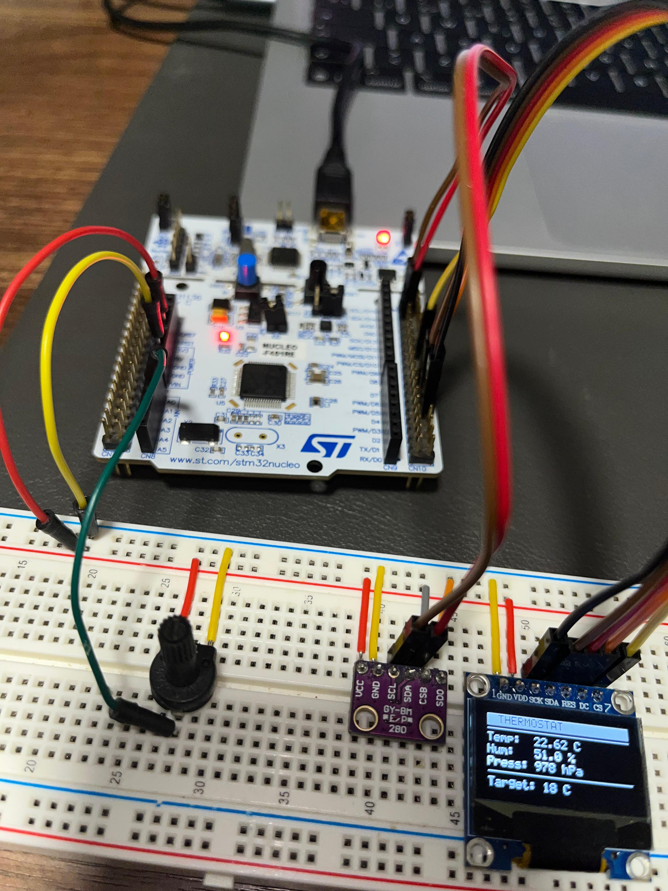
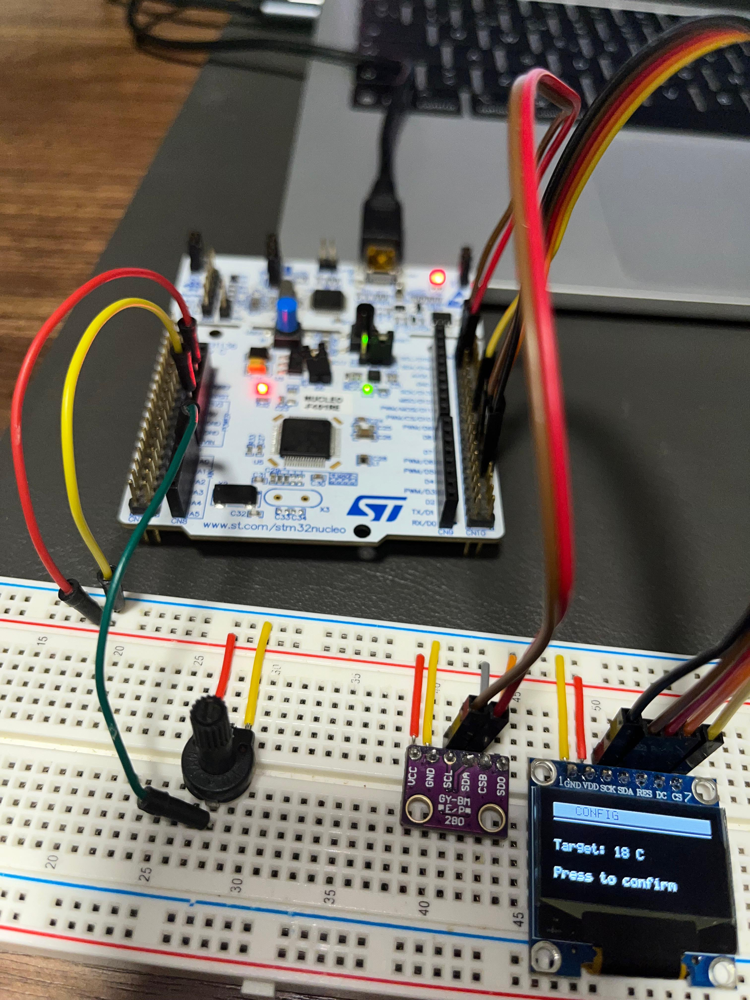
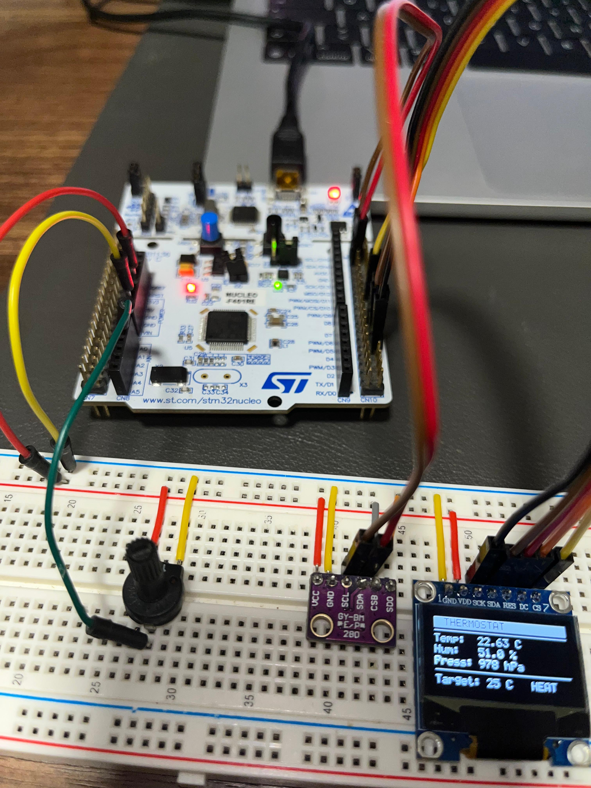

# Miguel Sergio

*Embedded Firmware Engineer - MCU/MPU, RTOS, bare-metal and low-level drivers.*

## Who I am

I build embedded firmware for MCU/MPU-based products. I focus on bare-metal and RTOS systems with clear architecture, observability and fault handling. I build firmware that not only works, but can be trusted in production.

I navigate datasheets and reference manuals to bring up peripherals from scratch, mapping register-level behavior, understanding clock trees, and configuring hardware without relying on vendor HALs. Platform or silicon family doesn't matter. If there's documentation, I can work with it.

## What I'm working on

Currently building a fault-tolerant thermostat on **STM32F401 + FreeRTOS** with software/hardware watchdog supervision, ARM MPU stack guard and persistent crash reporting over UART.

| RUNNING mode | CONFIG mode | Heating active |
|:---:|:---:|:---:|
|  |  |  |


## Tools I work with

```
MCUs & cores     ARM Cortex-M (M0/M3/M4/M7), adaptable to any architecture
Languages        C, C++, Python (test scripting)
RTOS             FreeRTOS
Peripherals      UART, SPI, I2C, ADC, PWM, DMA, EXTI, IWDG, MPU
Toolchain        cross-compilation toolchain (GCC-based), Make, CMake
Debug            GDB, OpenOCD, JTAG/SWD
Quality          CppUTest, gcovr, cppcheck, lizard, Doxygen
CI / infra       GitHub Actions, Docker
```
